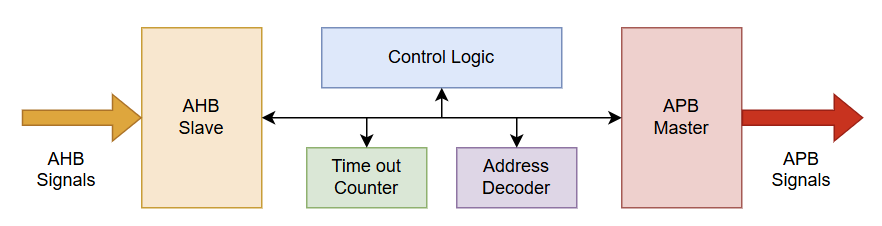
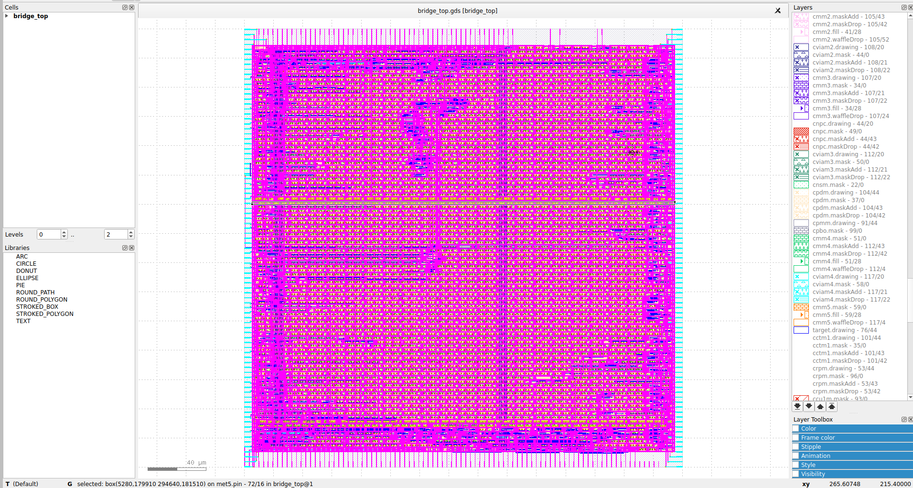

# AHB-Lite to APB4 Bridge

An AHB-Lite to APB4 bridge, taken through RTL design, functional verification, and a full RTL-to-GDSII ASIC flow on SkyWater SKY130 using OpenLane2.

## Overview

The bridge connects a single AHB-Lite master interface to up to 4 APB4 peripheral slaves, translating AHB-Lite transactions into APB3/APB4-style SETUP/ACCESS sequences and routing them to the correct slave based on address.

| | |
|---|---|
| Top module | `bridge_top` |
| AHB side | AHB-Lite slave, supports NONSEQ and SEQ (burst) transfers |
| APB side | APB4 master, 4 slaves, address-decoded |
| Max transfer size | 32-bit (word) |
| Clock | Single clock domain (`hclk`) |
| Target PDK | SkyWater SKY130 (`sky130_fd_sc_hd`) |
| Signoff frequency | 150 MHz |

## Architecture




- **AHB Slave** — Address/data phase latching, transfer validation (size check), drives `HREADYOUT`/`HRESP`.
- **Control FSM** — 5-state (`IDLE`, `SETUP`, `ACCESS`, `ERR1`, `ERR2`) controller sequencing the APB protocol and AHB response.
- **APB Master** — Drives the shared APB bus (`PADDR`, `PWDATA`, `PSEL`, `PENABLE`, `PSTRB`), muxes the selected slave's response back to the FSM.
- **Address Decoder** — Maps the top nibble of the address to one of 4 slaves (`0x0000_0000`–`0x0FFF_FFFF` → slave 0, and so on).
- **Watchdog Timer** — Parameterized timeout counter (max width 8 bits) that aborts a hung APB transaction and routes to the error states.

**Known limitation:** `HPROT`/`PPROT` are present in the port list but not yet implemented — deferred for a future pass.

## Verification

- Functional simulation with a self-checking waveform-based testbench.
- SystemVerilog Assertions added incrementally, starting with the watchdog timer (`timeout_counter`): start/stop behavior, timeout assertion, and 4 cover properties — all passing in Synopsys VCS.
- Two RTL timing fixes made during physical implementation (see below) were re-simulated to confirm cycle-accurate behavior was preserved.

## Physical Implementation (SKY130 / OpenLane2)

Signoff metrics at 150 MHz (`CLOCK_PERIOD = 6.67 ns`):

| Check | Result |
|---|---|
| DRC | ✅ Pass |
| LVS | ✅ Pass |
| Antenna | ✅ Pass |
| Worst setup slack (all corners) | +0.3667 ns (`max_ss_100C_1v60`) |
| Worst hold slack (all corners) | +0.0428 ns (`max_ss_100C_1v60`) |
| Setup/hold violations | 0, across all 9 PVT corners |

## Layout



### Design and debug notes

A few real issues came up going from RTL to a signed-off layout, worth noting since they're the actual engineering content of this project, not just "ran the flow":

1. **IO-pin-bound floorplan.** `bridge_top` has 326 top-level IO pins (wide AHB/APB buses, including a `[3:0][31:0]` `PRDATA` array that flattens to 128 individual pins). OpenLane's default relative floorplan sizing produced a die too small to physically place that many pins (`PPL-0024`). Fixed with an explicit `DIE_AREA`/`FP_SIZING: absolute` large enough for the required IO perimeter.

2. **Combinational path to `HREADYOUT`.** STA found a critical path running from the control FSM's state register, through the APB master's 4-slave response mux (`PREADY`/`PSLVERR` select logic), straight to the `HREADYOUT` output pin with no register in between. Fixed by registering the muxed `apb_ready`/`apb_error`/`apb_rdata` as a single pipeline stage inside the APB master — the FSM's existing level-sensitive wait loop (`if (apb_ready) ... else if (timeout_expired) ...`) absorbed the added cycle with no FSM changes needed.

3. **A second combinational path to `PSEL`** was found during the earlier push for a higher clock target — `apb_start`/`apb_penable_en` are decoded combinationally from the FSM's state register and routed directly to an output pin. The fix would be the same retiming technique as #2 (compute the decode one cycle early off `next_state`, register it directly). This path only violates when targeting frequencies above roughly 165–170 MHz; it was left un-fixed since the 150 MHz signoff target doesn't require it, prioritizing a verified, lower-risk result over chasing an unnecessary frequency.

4. **Custom SDC.** The flow's default fallback timing constraints modeled IO as if driving an off-chip package pin. Since this bridge's APB/AHB interfaces are meant to connect on-chip, a custom SDC with realistic on-chip input/output delay budgets was written instead of relying on the generic fallback.

### Running the flow

```bash
nix-shell   # inside an OpenLane2 checkout
openlane config.json
```

## Repository Structure

```
.
├── src/          RTL source (bridge_top, ahb_slave, apb_master, address_decoder, timeout_counter, control_fsm)
├── tb/           Testbenches
├── sdc/          Timing constraints
├── config.json   OpenLane2 flow configuration
└── results/      STA summary, worst-case timing report, metrics, final GDSII
```
